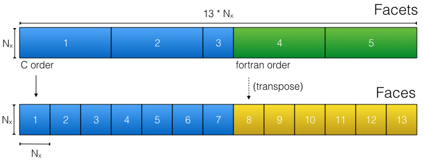
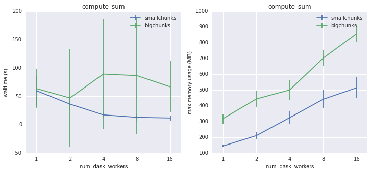
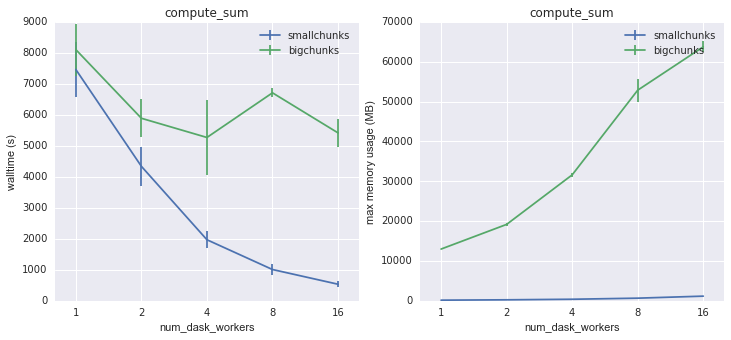
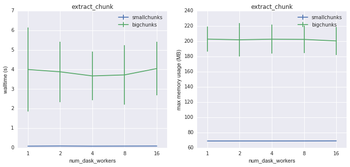
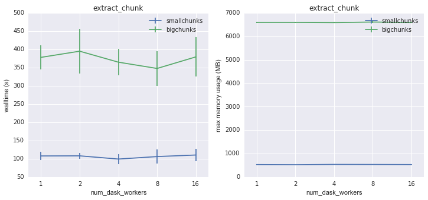
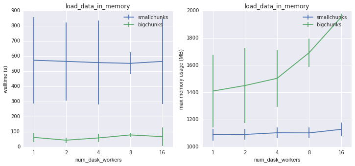
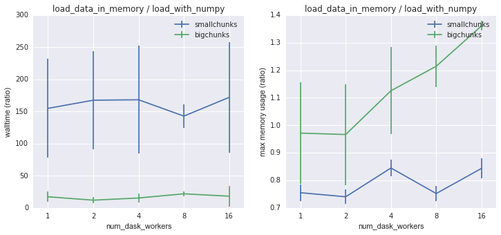

Performance Issues
==================

A major goal of xmitgcm is to achieve scalable performance with very large
datasets. We were motivated by the new
`LLC4320 <file:///Users/rpa/RND/Public/xmitgcm/doc/_build/html/index.html>`_
simulations run by
`Dimitris Menemenlis <https://science.jpl.nasa.gov/people/Menemenlis/>`_
and
`Chris Hill <https://eapsweb.mit.edu/people/cnh>`_ on NASA's
Pleiades_ supercomputer.

This page documents ongoing research into the performance of xmitgcm.

LLC Reading Strategies
----------------------

The physical layout of the LLC MDS files creates a challenge for performance.
Some of the cube facets are written with C order, while others are written
with Fortran order. This means that complex logic is required to translate the
raw data on disk to the desired logical array layout within xarray. Because of
this complication, the raw data cannot be accessed using the numpy
`ndarray data model <https://docs.scipy.org/doc/numpy/reference/arrays.ndarray.html>`_.

   The physical layout of a single level of LLC data in terms of facets (top)
   and the translation by xmitgcm to faces (bottom).

Two different approaches to reading LLC data have been developed. This option
is specified via the ``llc_method`` keyword in ``open_mdsdataset``.

smallchunks
~~~~~~~~~~~

``method="smallchunks"`` creates a large number of small dask chunks to
represent the
array. A chunk (of size nx x nx) is created for each face of each vertical
level. The total number of chunks is consequently 13 * nz. This appears
to perform better when you want to access a small subset of a very large model,
since only the required data will be read. It has a much lower memory footprint
than bigchunks. No memmaps are used withsmallchunks, since that implies leaving
a huge number of files open. Instead, each chunk is read directly by
``numpy.fromfile``.

bigchunks
~~~~~~~~~

``method="bigchunks"`` loads the entire raw data on disk as either a
``numpy.memmap`` (default) or directly as a numpy array. It then slices this
array into facets, reshapes them as necessary, slices each facet into faces,
and concatenates the faces along a new dimension using
``dask.array.concatentate``. This approach can be more efficient if the goal is
to read all of the array data into memory. Any attempt to read data from the
reshaped faces (faces 8-13 in the cartoon above) will trigger the
*entire facet* to be loaded into memory. For this reason, the bigchunks method
is impractical for very large LLC datasets that don't easily fit into memory

comparison
~~~~~~~~~~

A `test script <https://gist.github.com/rabernat/3c488b5b12f34a05027770e1cc6ebae6>`_
was developed to evaluate the two strategies for reading LLC4320 data on
Pleiades_. Files were selected for analysis randomly from over 10000 files on
disk in order to avoid any caching from the filesystem. The data were read
using the low level routine ``read_3d_llc_data`` (see :doc:`/utils`). Tests
were performed on both 2D data (4320 x 56160 32-bit floats) and 3D data
(4320 x 56160 x 90 32-bit floats).

The first task was a reduction: computing the sum of the array. For 2D data,
the smallchunks method performed marginally better in terms of speed and
memory usage.

   Walltime and memory usage for ``compute_sum`` on 2D data as a function of
   number of dask workers

However, a dramatic difference was evident for 3D data. The inefficient memory
usage of bigchunks is especially evident for large numbers of dask workers,
since each worker repeatedly triggers the loading of whole array facets.

  Walltime and memory usage for ``compute_sum`` on 3D data as a function of
  number of dask workers

For this sort of reduction workflow, smallchunks with a large number of dask
workers is the clear winner.

A second common workflow is subsetting. In the test script, we load into memory
1080 x 1080 region from chunk 2.

   Walltime and memory usage for ``extract_chunk`` on 2D data as a function of
   number of dask workers

Again, smallchunks is the clear winner here, with much faster execution and
lower memory usage. Interestingly, there is little speedup using multiple
multiple workers. All the same conclusions are true for 3D data.

  Walltime and memory usage for ``extract_chunk`` on 3D data as a function of
  number of dask workers

A final workload is simply loading the whole array into memory. (This turned out
to be impossible for 3D data, since the compute nodes ran out of memory in the
process.) This is the only workload where bigchunks has some advantages. Here
a tradeoff between speed and memory usage is clear: bigchunks goes faster
because it reads the data in bigger chunks, but it also uses much more memory.

  Walltime and memory usage for ``load_data_in_memory`` on 2D data as a
  function of number of dask workers

It is useful to compare these numbers to the speed of a raw ``numpy.fromfile``
read of the data. This measures the overhead associated with chunking and
reshaping the data from its physical layout on disk to the desired logical
layout. Reading with smallchunks takes about 150 times the raw read time, while
for bigchunks it is more like 10 times. Here there is a *disadvantage* to using
multiple dask workers; while there is no speed improvement, the memory usage
increases with number of workers for bigchunks.

  Walltime and memory usage for ``load_data_in_memory`` on 2D data as a
  function of number of dask workers, normalized against loading the same
  data directly using ``numpy.fromfile``.

Running xmitgcm on Pleaides
---------------------------

These instructions describe how to get a working xmitgcm environment on a
cluster such as Pleiades_. (See related
`blog post <https://medium.com/@rabernat/custom-conda-environments-for-data-science-on-hpc-clusters-32d58c63aa95>`_)

Step 1: Install miniconda in user space
~~~~~~~~~~~~~~~~~~~~~~~~~~~~~~~~~~~~~~~

Miniconda is a mini version of Anaconda that includes just conda and its
dependencies. It is a very small download. If you want to use python 3
(recommended) you can call::

  wget https://repo.continuum.io/miniconda/Miniconda3-latest-Linux-x86_64.sh -O miniconda.sh

or for python 2.7::

  wget https://repo.continuum.io/miniconda/Miniconda2-latest-Linux-x86_64.sh -O miniconda.sh

Step 2: Run Miniconda
~~~~~~~~~~~~~~~~~~~~~

Now you actually run miniconda to install the package manager. The trick is to
specify the install directory within your home directory, rather in the default
system-wide installation (which you won’t have permissions to do).
You then have to add this directory to your path::

  bash miniconda.sh -b -p $HOME/miniconda export PATH="$HOME/miniconda/bin:$PATH"

Step 3: Create a custom conda environment specification
~~~~~~~~~~~~~~~~~~~~~~~~~~~~~~~~~~~~~~~~~~~~~~~~~~~~~~~
You now have to define what packages you actually want to install. A good way
to do this is with a custom conda environment file. The contents of this file
will differ for each project. Below is an environment.yml suitable for
xmitgcm::

  name: xmitgcm
  dependencies:
    - numpy
    - scipy
    - xarray
    - netcdf4
    - dask
    - jupyter
    - matplotlib
    - pip:
      - pytest
      - xmitgcm

Create a similar file and save it as environment.yml.

Step 4: Create the conda environment
~~~~~~~~~~~~~~~~~~~~~~~~~~~~~~~~~~~~

You should now be able to run the following command::

  conda env create --file environment.yml

This will download and install all the packages and their dependencies.

Step 5: Activate The environment
~~~~~~~~~~~~~~~~~~~~~~~~~~~~~~~~

The environment you created needs to be activated before you can actually use
it. To do this, you call::

  source activate xmitgcm

This step needs to be repeated whenever you want to use the environment (i.e.
every time you launch an interactive job or call python from within a batch
job).

Step 6: Use xmitgcm
~~~~~~~~~~~~~~~~~~~
You can now call ipython on the command line or launch a jupyter notebook and
import xmitgcm. This should be done from a compute node, rather than the head
node.

.. _Pleiades: https://www.nas.nasa.gov/hecc/resources/pleiades.html

Example Pleiades Scripts
------------------------

Below is an example python which extracts a subset from the LLC4320 simulation
on Pleiades_ and saves it a sequence of netCDF files.

.. code-block:: python

  import os
  import sys
  import numpy as np
  import xarray as xr
  import dask
  from multiprocessing.pool import ThreadPool
  from xmitgcm import open_mdsdataset

  # By default, dask will use one worker for each core available.
  # This can be changed by uncommenting below
  #dask.set_options(pool=ThreadPool(4))

  # where the data lives
  data_dir = '/u/dmenemen/llc_4320/MITgcm/run/'
  grid_dir = '/u/dmenemen/llc_4320/grid/'
  # where to save the subsets
  outdir_base = '/nobackup/rpaberna/LLC/tile_data/'

  dtype = np.dtype('>f4')

  # can complete 300 files in < 12 hours
  nfiles = 300

  # the first available iteration is iter0=10368
  # we start from an iteration number specified on the command line
  iter0 = int(sys.argv[1])

  delta = 144 # iters
  delta_t = 25. # seconds
  all_iters = iter0 + delta*np.arange(nfiles)

  region_name = 'agulhas'
  region_slice = {'face': 1,
                  'i': slice(1080,3240), 'i_g': slice(1080,3240),
                  'j': slice(0,2160), 'j_g': slice(0,2160)}

  fprefix = 'llc_4320_%s' % region_name
  outdir = os.path.join(outdir_base, fprefix)

  ds = open_mdsdataset(data_dir, grid_dir=grid_dir,
                       iters=list(all_iters), geometry='llc', read_grid=False,
                       default_dtype=np.dtype('>f4'), delta_t=delta_t,
                       ignore_unknown_vars=True)

  region = ds.isel(**region_slice)

  # group for writing
  iters, datasets = zip(*region.groupby('iter'))
  paths = [os.path.join(outdir, '%s.%010d.nc' % (fprefix, d))
           for d in iters]

  # write the data...takes a long time and executes in parallel
  xr.save_mfdataset(datasets, paths, engine='netcdf4')

Here is a batch job which calls the script

.. code-block:: bash

  #!/bin/bash
  #PBS -N read_llc
  #PBS -l select=1:ncpus=28:model=bro
  #PBS -l walltime=12:00:00

  source activate xmitgcm
  cd $PBS_O_WORKDIR
  # the first available iteration
  iter0=10368
  python -u write_by_iternum.py $iter0

.. _Pleiades: https://www.nas.nasa.gov/hecc/resources/pleiades.html
